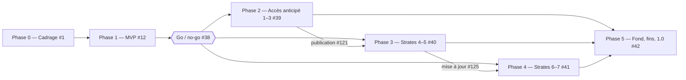
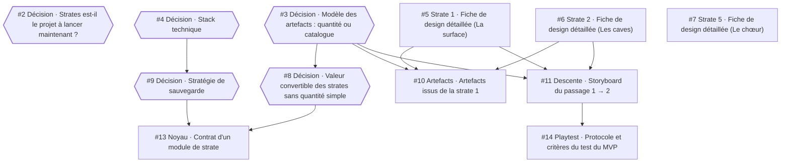
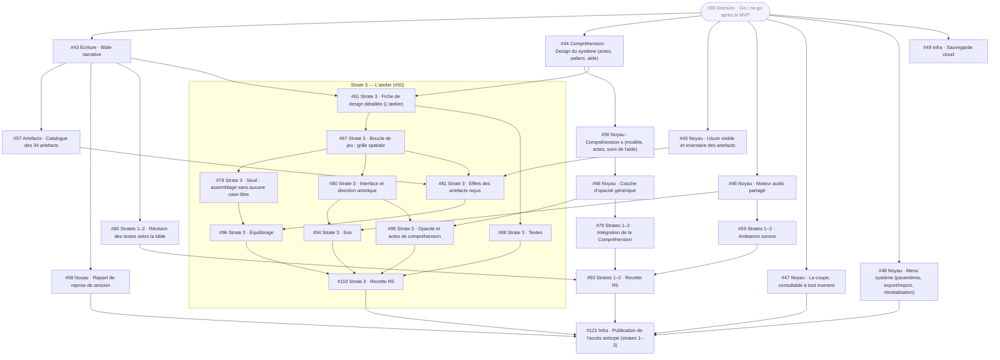
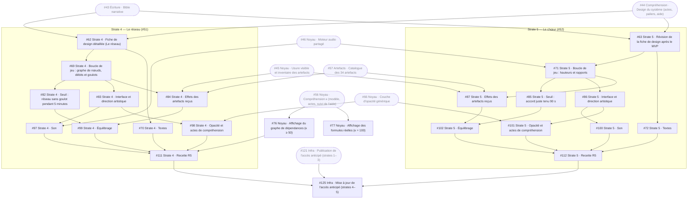
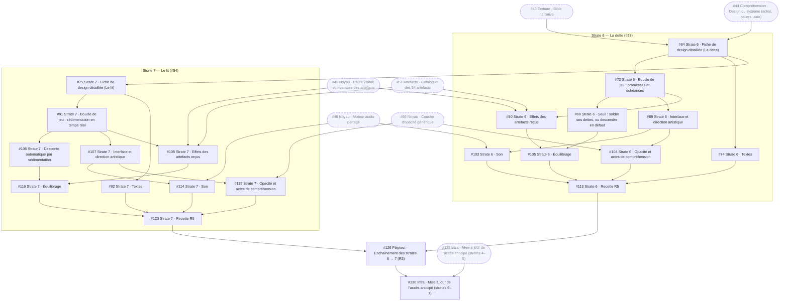

# Roadmap

Planning des tâches de Strates, organisé par **dépendances** et non par dates. Les issues GitHub font foi. Ce document est un instantané pris à leur création (24 septembre 2026) ; il se régénère si le backlog change beaucoup.

Conventions : voir le [README](../README.md#organisation-des-tâches).

## Vue d'ensemble

| Phase | Épopée | Contenu | Sortie de phase | Tâches |
|---|---|---|---|---|
| Phase 0 | [#1](https://github.com/DavidGiangiacomo/strates/issues/1) | Trous du design doc, stack, architecture, fiches des strates 1, 2 et 5 | Critères du test du MVP écrits | 12 |
| Phase 1 | [#12](https://github.com/DavidGiangiacomo/strates/issues/12) | Noyau, strates 1 et 2, descente, conversion | **Décision go / no-go** [#38](https://github.com/DavidGiangiacomo/strates/issues/38) | 24 |
| Phase 2 | [#39](https://github.com/DavidGiangiacomo/strates/issues/39) | Compréhension, opacité, artefacts, audio, coupe, strate 3 | Accès anticipé publié [#121](https://github.com/DavidGiangiacomo/strates/issues/121) | 26 |
| Phase 3 | [#40](https://github.com/DavidGiangiacomo/strates/issues/40) | Strates 4 et 5, affichages κ | Mise à jour de l'accès anticipé [#125](https://github.com/DavidGiangiacomo/strates/issues/125) | 23 |
| Phase 4 | [#41](https://github.com/DavidGiangiacomo/strates/issues/41) | Strates 6 et 7, playtest R3 | Mise à jour de l'accès anticipé [#130](https://github.com/DavidGiangiacomo/strates/issues/130) | 22 |
| Phase 5 | [#42](https://github.com/DavidGiangiacomo/strates/issues/42) | Strate 8, fins, épilogue, audit, décision R5 | **Sortie 1.0** [#134](https://github.com/DavidGiangiacomo/strates/issues/134) | 15 |

122 tâches et 12 épopées, soit 134 issues.

Les phases 2, 3 et 4 ne sont pas strictement séquentielles. Les strates sont **indépendantes** (R2), et leurs tâches ne dépendent que des systèmes du noyau et des décisions de cadrage. Seules les publications de l'accès anticipé s'enchaînent.

## Par où commencer

Tâches sans aucune dépendance, démarrables tout de suite :

- [#2](https://github.com/DavidGiangiacomo/strates/issues/2) — Décision · Strates est-il le projet à lancer maintenant ?
- [#3](https://github.com/DavidGiangiacomo/strates/issues/3) — Décision · Modèle des artefacts : quantité ou catalogue
- [#4](https://github.com/DavidGiangiacomo/strates/issues/4) — Décision · Stack technique
- [#5](https://github.com/DavidGiangiacomo/strates/issues/5) — Strate 1 · Fiche de design détaillée (La surface)
- [#6](https://github.com/DavidGiangiacomo/strates/issues/6) — Strate 2 · Fiche de design détaillée (Les caves)
- [#7](https://github.com/DavidGiangiacomo/strates/issues/7) — Strate 5 · Fiche de design détaillée (Le chœur)

Parmi elles, les décisions sur le modèle des artefacts [#3](https://github.com/DavidGiangiacomo/strates/issues/3) et la stack [#4](https://github.com/DavidGiangiacomo/strates/issues/4) débloquent le plus de travail : elles mènent au contrat de module [#13](https://github.com/DavidGiangiacomo/strates/issues/13), dont dépend tout le code du noyau.

## Points de décision

| Issue | Décision | Débloque |
|---|---|---|
| [#2](https://github.com/DavidGiangiacomo/strates/issues/2) | Strates est-il le projet à lancer maintenant ? | le démarrage de la phase 1 |
| [#3](https://github.com/DavidGiangiacomo/strates/issues/3) | Modèle des artefacts : quantité ou catalogue | la conversion, le noyau, les artefacts |
| [#4](https://github.com/DavidGiangiacomo/strates/issues/4) | Stack technique | l'initialisation du projet |
| [#8](https://github.com/DavidGiangiacomo/strates/issues/8) | Valeur convertible des strates sans quantité simple | le contrat de module |
| [#9](https://github.com/DavidGiangiacomo/strates/issues/9) | Stratégie de sauvegarde | le contrat de module, la sauvegarde |
| [#38](https://github.com/DavidGiangiacomo/strates/issues/38) | Go / no-go après le MVP | **toutes les phases 2 à 5** |
| [#133](https://github.com/DavidGiangiacomo/strates/issues/133) | Garder 8 strates ou en retirer une (R5) | la sortie 1.0 |

Le design de la Compréhension [#44](https://github.com/DavidGiangiacomo/strates/issues/44) contient aussi une décision à prendre : le palier κ = 100, qui n'est atteint qu'au fond tel que le rythme du §9 est écrit.

## Chemin critique

La plus longue chaîne de tâches dépendantes, de la première décision jusqu'à la sortie 1.0 : **21 tâches** qui ne peuvent pas se faire en parallèle. Sans estimation de durée, elle est comptée en nombre de tâches. Elle donne l'ordre à respecter en priorité.

1. [#3](https://github.com/DavidGiangiacomo/strates/issues/3) — Décision · Modèle des artefacts : quantité ou catalogue
2. [#8](https://github.com/DavidGiangiacomo/strates/issues/8) — Décision · Valeur convertible des strates sans quantité simple
3. [#13](https://github.com/DavidGiangiacomo/strates/issues/13) — Noyau · Contrat d'un module de strate
4. [#18](https://github.com/DavidGiangiacomo/strates/issues/18) — Noyau · État global, registre des modules et boucle de tick
5. [#24](https://github.com/DavidGiangiacomo/strates/issues/24) — Strate 1 · Boucle de jeu
6. [#29](https://github.com/DavidGiangiacomo/strates/issues/29) — Strate 1 · Seuil de fouille et bouton « creuser »
7. [#35](https://github.com/DavidGiangiacomo/strates/issues/35) — Strate 1 · Équilibrage
8. [#37](https://github.com/DavidGiangiacomo/strates/issues/37) — Playtest · Test du MVP (§14)
9. [#38](https://github.com/DavidGiangiacomo/strates/issues/38) — Décision · Go / no-go après le MVP
10. [#43](https://github.com/DavidGiangiacomo/strates/issues/43) — Écriture · Bible narrative
11. [#64](https://github.com/DavidGiangiacomo/strates/issues/64) — Strate 6 · Fiche de design détaillée (La dette)
12. [#75](https://github.com/DavidGiangiacomo/strates/issues/75) — Strate 7 · Fiche de design détaillée (Le lit)
13. [#91](https://github.com/DavidGiangiacomo/strates/issues/91) — Strate 7 · Boucle de jeu : sédimentation en temps réel
14. [#106](https://github.com/DavidGiangiacomo/strates/issues/106) — Strate 7 · Descente automatique par sédimentation
15. [#116](https://github.com/DavidGiangiacomo/strates/issues/116) — Strate 7 · Équilibrage
16. [#120](https://github.com/DavidGiangiacomo/strates/issues/120) — Strate 7 · Recette R5
17. [#128](https://github.com/DavidGiangiacomo/strates/issues/128) — Fins · « Remonter » : la remontée accélérée
18. [#131](https://github.com/DavidGiangiacomo/strates/issues/131) — Fins · Épilogue « La coupe »
19. [#132](https://github.com/DavidGiangiacomo/strates/issues/132) — Playtest · Partie complète sur plusieurs semaines
20. [#133](https://github.com/DavidGiangiacomo/strates/issues/133) — Décision · Garder 8 strates ou en retirer une (R5)
21. [#134](https://github.com/DavidGiangiacomo/strates/issues/134) — Infra · Sortie 1.0

## Phase 0 — Cadrage

Épopée : [#1](https://github.com/DavidGiangiacomo/strates/issues/1). Les nœuds en pointillés sont des dépendances venues d'autres phases.

Tableau des 12 tâches de la phase

| # | Tâche | Bloquée par |
|---|---|---|
| [#2](https://github.com/DavidGiangiacomo/strates/issues/2) | Décision · Strates est-il le projet à lancer maintenant ? | — |
| [#3](https://github.com/DavidGiangiacomo/strates/issues/3) | Décision · Modèle des artefacts : quantité ou catalogue | — |
| [#4](https://github.com/DavidGiangiacomo/strates/issues/4) | Décision · Stack technique | — |
| [#5](https://github.com/DavidGiangiacomo/strates/issues/5) | Strate 1 · Fiche de design détaillée (La surface) | — |
| [#6](https://github.com/DavidGiangiacomo/strates/issues/6) | Strate 2 · Fiche de design détaillée (Les caves) | — |
| [#7](https://github.com/DavidGiangiacomo/strates/issues/7) | Strate 5 · Fiche de design détaillée (Le chœur) | — |
| [#8](https://github.com/DavidGiangiacomo/strates/issues/8) | Décision · Valeur convertible des strates sans quantité simple | [#3](https://github.com/DavidGiangiacomo/strates/issues/3) |
| [#9](https://github.com/DavidGiangiacomo/strates/issues/9) | Décision · Stratégie de sauvegarde | [#4](https://github.com/DavidGiangiacomo/strates/issues/4) |
| [#10](https://github.com/DavidGiangiacomo/strates/issues/10) | Artefacts · Artefacts issus de la strate 1 | [#3](https://github.com/DavidGiangiacomo/strates/issues/3), [#5](https://github.com/DavidGiangiacomo/strates/issues/5), [#6](https://github.com/DavidGiangiacomo/strates/issues/6) |
| [#11](https://github.com/DavidGiangiacomo/strates/issues/11) | Descente · Storyboard du passage 1 → 2 | [#3](https://github.com/DavidGiangiacomo/strates/issues/3), [#5](https://github.com/DavidGiangiacomo/strates/issues/5), [#6](https://github.com/DavidGiangiacomo/strates/issues/6) |
| [#13](https://github.com/DavidGiangiacomo/strates/issues/13) | Noyau · Contrat d'un module de strate | [#8](https://github.com/DavidGiangiacomo/strates/issues/8), [#9](https://github.com/DavidGiangiacomo/strates/issues/9) |
| [#14](https://github.com/DavidGiangiacomo/strates/issues/14) | Playtest · Protocole et critères du test du MVP | [#11](https://github.com/DavidGiangiacomo/strates/issues/11) |

## Phase 1 — MVP : strates 1 et 2 avec la descente

Épopée : [#12](https://github.com/DavidGiangiacomo/strates/issues/12). Les nœuds en pointillés sont des dépendances venues d'autres phases.

```mermaid
flowchart TD
  classDef ext stroke-dasharray: 4 3,opacity:0.75
  classDef dec stroke-width:2px
  n15["#15 Infra · Initialiser le projet (build, lint, tests, CI)"]
  n16["#16 Strate 1 · Textes"]
  n17["#17 Strate 2 · Textes"]
  n18["#18 Noyau · État global, registre des modules et boucle de tick"]
  n19["#19 Infra · Build de playtest publié sur le web"]
  n20["#20 Noyau · Sauvegarde et chargement locaux"]
  n21["#21 Noyau · Conversion en artefacts et table des artefacts"]
  n22["#22 Noyau · Bandeau commun de 24 px"]
  n23["#23 Infra · Simulateur headless pour l'équilibrage"]
  n24["#24 Strate 1 · Boucle de jeu"]
  n25["#25 Strate 2 · Boucle saisonnière"]
  n26["#26 Playtest · Journal de session (actions horodatées, export)"]
  n27["#27 Noyau · Progression hors-ligne"]
  n28["#28 Infra · Outils de développement (temps accéléré, saut de strate, édition d'état)"]
  n29["#29 Strate 1 · Seuil de fouille et bouton « creuser »"]
  n30["#30 Noyau · Orchestration de la descente et journal de partie"]
  n31["#31 Strate 1 · Interface et direction artistique"]
  n32["#32 Strate 2 · Calendrier et seuil « trois hivers sans rupture »"]
  n33["#33 Strate 2 · Interface et direction artistique"]
  n34["#34 Strate 2 · Effets des artefacts de la strate 1"]
  n35["#35 Strate 1 · Équilibrage"]
  n36["#36 Strate 2 · Équilibrage"]
  n37["#37 Playtest · Test du MVP (§14)"]
  n38{{"#38 Décision · Go / no-go après le MVP"}}:::dec
  n4(["#4 Décision · Stack technique"]):::ext
  n5(["#5 Strate 1 · Fiche de design détaillée (La surface)"]):::ext
  n6(["#6 Strate 2 · Fiche de design détaillée (Les caves)"]):::ext
  n7(["#7 Strate 5 · Fiche de design détaillée (Le chœur)"]):::ext
  n10(["#10 Artefacts · Artefacts issus de la strate 1"]):::ext
  n11(["#11 Descente · Storyboard du passage 1 → 2"]):::ext
  n13(["#13 Noyau · Contrat d'un module de strate"]):::ext
  n14(["#14 Playtest · Protocole et critères du test du MVP"]):::ext
  n4 --> n15
  n5 --> n16
  n6 --> n17
  n15 --> n18
  n13 --> n18
  n15 --> n19
  n18 --> n20
  n18 --> n21
  n18 --> n22
  n18 --> n23
  n18 --> n24
  n5 --> n24
  n18 --> n25
  n6 --> n25
  n18 --> n26
  n14 --> n26
  n20 --> n27
  n20 --> n28
  n24 --> n29
  n22 --> n29
  n20 --> n30
  n21 --> n30
  n22 --> n30
  n11 --> n30
  n24 --> n31
  n25 --> n32
  n25 --> n33
  n21 --> n34
  n25 --> n34
  n10 --> n34
  n29 --> n35
  n28 --> n35
  n32 --> n36
  n34 --> n36
  n28 --> n36
  n27 --> n37
  n30 --> n37
  n31 --> n37
  n16 --> n37
  n35 --> n37
  n33 --> n37
  n17 --> n37
  n36 --> n37
  n26 --> n37
  n19 --> n37
  n37 --> n38
  n7 --> n38
```

Tableau des 24 tâches de la phase

| # | Tâche | Bloquée par |
|---|---|---|
| [#15](https://github.com/DavidGiangiacomo/strates/issues/15) | Infra · Initialiser le projet (build, lint, tests, CI) | [#4](https://github.com/DavidGiangiacomo/strates/issues/4) |
| [#16](https://github.com/DavidGiangiacomo/strates/issues/16) | Strate 1 · Textes | [#5](https://github.com/DavidGiangiacomo/strates/issues/5) |
| [#17](https://github.com/DavidGiangiacomo/strates/issues/17) | Strate 2 · Textes | [#6](https://github.com/DavidGiangiacomo/strates/issues/6) |
| [#18](https://github.com/DavidGiangiacomo/strates/issues/18) | Noyau · État global, registre des modules et boucle de tick | [#15](https://github.com/DavidGiangiacomo/strates/issues/15), [#13](https://github.com/DavidGiangiacomo/strates/issues/13) |
| [#19](https://github.com/DavidGiangiacomo/strates/issues/19) | Infra · Build de playtest publié sur le web | [#15](https://github.com/DavidGiangiacomo/strates/issues/15) |
| [#20](https://github.com/DavidGiangiacomo/strates/issues/20) | Noyau · Sauvegarde et chargement locaux | [#18](https://github.com/DavidGiangiacomo/strates/issues/18) |
| [#21](https://github.com/DavidGiangiacomo/strates/issues/21) | Noyau · Conversion en artefacts et table des artefacts | [#18](https://github.com/DavidGiangiacomo/strates/issues/18) |
| [#22](https://github.com/DavidGiangiacomo/strates/issues/22) | Noyau · Bandeau commun de 24 px | [#18](https://github.com/DavidGiangiacomo/strates/issues/18) |
| [#23](https://github.com/DavidGiangiacomo/strates/issues/23) | Infra · Simulateur headless pour l'équilibrage | [#18](https://github.com/DavidGiangiacomo/strates/issues/18) |
| [#24](https://github.com/DavidGiangiacomo/strates/issues/24) | Strate 1 · Boucle de jeu | [#18](https://github.com/DavidGiangiacomo/strates/issues/18), [#5](https://github.com/DavidGiangiacomo/strates/issues/5) |
| [#25](https://github.com/DavidGiangiacomo/strates/issues/25) | Strate 2 · Boucle saisonnière | [#18](https://github.com/DavidGiangiacomo/strates/issues/18), [#6](https://github.com/DavidGiangiacomo/strates/issues/6) |
| [#26](https://github.com/DavidGiangiacomo/strates/issues/26) | Playtest · Journal de session (actions horodatées, export) | [#18](https://github.com/DavidGiangiacomo/strates/issues/18), [#14](https://github.com/DavidGiangiacomo/strates/issues/14) |
| [#27](https://github.com/DavidGiangiacomo/strates/issues/27) | Noyau · Progression hors-ligne | [#20](https://github.com/DavidGiangiacomo/strates/issues/20) |
| [#28](https://github.com/DavidGiangiacomo/strates/issues/28) | Infra · Outils de développement (temps accéléré, saut de strate, édition d'état) | [#20](https://github.com/DavidGiangiacomo/strates/issues/20) |
| [#29](https://github.com/DavidGiangiacomo/strates/issues/29) | Strate 1 · Seuil de fouille et bouton « creuser » | [#24](https://github.com/DavidGiangiacomo/strates/issues/24), [#22](https://github.com/DavidGiangiacomo/strates/issues/22) |
| [#30](https://github.com/DavidGiangiacomo/strates/issues/30) | Noyau · Orchestration de la descente et journal de partie | [#20](https://github.com/DavidGiangiacomo/strates/issues/20), [#21](https://github.com/DavidGiangiacomo/strates/issues/21), [#22](https://github.com/DavidGiangiacomo/strates/issues/22), [#11](https://github.com/DavidGiangiacomo/strates/issues/11) |
| [#31](https://github.com/DavidGiangiacomo/strates/issues/31) | Strate 1 · Interface et direction artistique | [#24](https://github.com/DavidGiangiacomo/strates/issues/24) |
| [#32](https://github.com/DavidGiangiacomo/strates/issues/32) | Strate 2 · Calendrier et seuil « trois hivers sans rupture » | [#25](https://github.com/DavidGiangiacomo/strates/issues/25) |
| [#33](https://github.com/DavidGiangiacomo/strates/issues/33) | Strate 2 · Interface et direction artistique | [#25](https://github.com/DavidGiangiacomo/strates/issues/25) |
| [#34](https://github.com/DavidGiangiacomo/strates/issues/34) | Strate 2 · Effets des artefacts de la strate 1 | [#21](https://github.com/DavidGiangiacomo/strates/issues/21), [#25](https://github.com/DavidGiangiacomo/strates/issues/25), [#10](https://github.com/DavidGiangiacomo/strates/issues/10) |
| [#35](https://github.com/DavidGiangiacomo/strates/issues/35) | Strate 1 · Équilibrage | [#29](https://github.com/DavidGiangiacomo/strates/issues/29), [#28](https://github.com/DavidGiangiacomo/strates/issues/28) |
| [#36](https://github.com/DavidGiangiacomo/strates/issues/36) | Strate 2 · Équilibrage | [#32](https://github.com/DavidGiangiacomo/strates/issues/32), [#34](https://github.com/DavidGiangiacomo/strates/issues/34), [#28](https://github.com/DavidGiangiacomo/strates/issues/28) |
| [#37](https://github.com/DavidGiangiacomo/strates/issues/37) | Playtest · Test du MVP (§14) | [#27](https://github.com/DavidGiangiacomo/strates/issues/27), [#30](https://github.com/DavidGiangiacomo/strates/issues/30), [#31](https://github.com/DavidGiangiacomo/strates/issues/31), [#16](https://github.com/DavidGiangiacomo/strates/issues/16), [#35](https://github.com/DavidGiangiacomo/strates/issues/35), [#33](https://github.com/DavidGiangiacomo/strates/issues/33), [#17](https://github.com/DavidGiangiacomo/strates/issues/17), [#36](https://github.com/DavidGiangiacomo/strates/issues/36), [#26](https://github.com/DavidGiangiacomo/strates/issues/26), [#19](https://github.com/DavidGiangiacomo/strates/issues/19) |
| [#38](https://github.com/DavidGiangiacomo/strates/issues/38) | Décision · Go / no-go après le MVP | [#37](https://github.com/DavidGiangiacomo/strates/issues/37), [#7](https://github.com/DavidGiangiacomo/strates/issues/7) |

## Phase 2 — Accès anticipé : strates 1 à 3

Épopée : [#39](https://github.com/DavidGiangiacomo/strates/issues/39). Les nœuds en pointillés sont des dépendances venues d'autres phases.

Tableau des 26 tâches de la phase

| # | Tâche | Bloquée par |
|---|---|---|
| [#43](https://github.com/DavidGiangiacomo/strates/issues/43) | Écriture · Bible narrative | [#38](https://github.com/DavidGiangiacomo/strates/issues/38) |
| [#44](https://github.com/DavidGiangiacomo/strates/issues/44) | Compréhension · Design du système (actes, paliers, aide) | [#38](https://github.com/DavidGiangiacomo/strates/issues/38) |
| [#45](https://github.com/DavidGiangiacomo/strates/issues/45) | Noyau · Usure visible et inventaire des artefacts | [#38](https://github.com/DavidGiangiacomo/strates/issues/38) |
| [#46](https://github.com/DavidGiangiacomo/strates/issues/46) | Noyau · Moteur audio partagé | [#38](https://github.com/DavidGiangiacomo/strates/issues/38) |
| [#47](https://github.com/DavidGiangiacomo/strates/issues/47) | Noyau · La coupe, consultable à tout moment | [#38](https://github.com/DavidGiangiacomo/strates/issues/38) |
| [#48](https://github.com/DavidGiangiacomo/strates/issues/48) | Noyau · Menu système (paramètres, export/import, réinitialisation) | [#38](https://github.com/DavidGiangiacomo/strates/issues/38) |
| [#49](https://github.com/DavidGiangiacomo/strates/issues/49) | Infra · Sauvegarde cloud | [#38](https://github.com/DavidGiangiacomo/strates/issues/38) |
| [#56](https://github.com/DavidGiangiacomo/strates/issues/56) | Noyau · Compréhension κ (modèle, actes, suivi de l'aide) | [#44](https://github.com/DavidGiangiacomo/strates/issues/44) |
| [#57](https://github.com/DavidGiangiacomo/strates/issues/57) | Artefacts · Catalogue des 34 artefacts | [#43](https://github.com/DavidGiangiacomo/strates/issues/43) |
| [#58](https://github.com/DavidGiangiacomo/strates/issues/58) | Noyau · Rappel de reprise de session | [#43](https://github.com/DavidGiangiacomo/strates/issues/43) |
| [#59](https://github.com/DavidGiangiacomo/strates/issues/59) | Strates 1–2 · Ambiance sonore | [#46](https://github.com/DavidGiangiacomo/strates/issues/46) |
| [#60](https://github.com/DavidGiangiacomo/strates/issues/60) | Strates 1–2 · Révision des textes selon la bible | [#43](https://github.com/DavidGiangiacomo/strates/issues/43) |
| [#61](https://github.com/DavidGiangiacomo/strates/issues/61) | Strate 3 · Fiche de design détaillée (L'atelier) | [#43](https://github.com/DavidGiangiacomo/strates/issues/43), [#44](https://github.com/DavidGiangiacomo/strates/issues/44) |
| [#66](https://github.com/DavidGiangiacomo/strates/issues/66) | Noyau · Couche d'opacité générique | [#56](https://github.com/DavidGiangiacomo/strates/issues/56) |
| [#67](https://github.com/DavidGiangiacomo/strates/issues/67) | Strate 3 · Boucle de jeu : grille spatiale | [#61](https://github.com/DavidGiangiacomo/strates/issues/61) |
| [#68](https://github.com/DavidGiangiacomo/strates/issues/68) | Strate 3 · Textes | [#61](https://github.com/DavidGiangiacomo/strates/issues/61) |
| [#78](https://github.com/DavidGiangiacomo/strates/issues/78) | Strates 1–2 · Intégration de la Compréhension | [#66](https://github.com/DavidGiangiacomo/strates/issues/66) |
| [#79](https://github.com/DavidGiangiacomo/strates/issues/79) | Strate 3 · Seuil : assemblage sans aucune case libre | [#67](https://github.com/DavidGiangiacomo/strates/issues/67) |
| [#80](https://github.com/DavidGiangiacomo/strates/issues/80) | Strate 3 · Interface et direction artistique | [#67](https://github.com/DavidGiangiacomo/strates/issues/67) |
| [#81](https://github.com/DavidGiangiacomo/strates/issues/81) | Strate 3 · Effets des artefacts reçus | [#67](https://github.com/DavidGiangiacomo/strates/issues/67), [#57](https://github.com/DavidGiangiacomo/strates/issues/57), [#45](https://github.com/DavidGiangiacomo/strates/issues/45) |
| [#93](https://github.com/DavidGiangiacomo/strates/issues/93) | Strates 1–2 · Recette R5 | [#78](https://github.com/DavidGiangiacomo/strates/issues/78), [#59](https://github.com/DavidGiangiacomo/strates/issues/59), [#60](https://github.com/DavidGiangiacomo/strates/issues/60) |
| [#94](https://github.com/DavidGiangiacomo/strates/issues/94) | Strate 3 · Son | [#80](https://github.com/DavidGiangiacomo/strates/issues/80), [#46](https://github.com/DavidGiangiacomo/strates/issues/46) |
| [#95](https://github.com/DavidGiangiacomo/strates/issues/95) | Strate 3 · Opacité et actes de compréhension | [#80](https://github.com/DavidGiangiacomo/strates/issues/80), [#66](https://github.com/DavidGiangiacomo/strates/issues/66) |
| [#96](https://github.com/DavidGiangiacomo/strates/issues/96) | Strate 3 · Équilibrage | [#79](https://github.com/DavidGiangiacomo/strates/issues/79), [#81](https://github.com/DavidGiangiacomo/strates/issues/81) |
| [#110](https://github.com/DavidGiangiacomo/strates/issues/110) | Strate 3 · Recette R5 | [#96](https://github.com/DavidGiangiacomo/strates/issues/96), [#94](https://github.com/DavidGiangiacomo/strates/issues/94), [#68](https://github.com/DavidGiangiacomo/strates/issues/68), [#95](https://github.com/DavidGiangiacomo/strates/issues/95) |
| [#121](https://github.com/DavidGiangiacomo/strates/issues/121) | Infra · Publication de l'accès anticipé (strates 1–3) | [#47](https://github.com/DavidGiangiacomo/strates/issues/47), [#58](https://github.com/DavidGiangiacomo/strates/issues/58), [#48](https://github.com/DavidGiangiacomo/strates/issues/48), [#93](https://github.com/DavidGiangiacomo/strates/issues/93), [#110](https://github.com/DavidGiangiacomo/strates/issues/110) |

## Phase 3 — Strates 4 et 5

Épopée : [#40](https://github.com/DavidGiangiacomo/strates/issues/40). Les nœuds en pointillés sont des dépendances venues d'autres phases.

Tableau des 23 tâches de la phase

| # | Tâche | Bloquée par |
|---|---|---|
| [#62](https://github.com/DavidGiangiacomo/strates/issues/62) | Strate 4 · Fiche de design détaillée (Le réseau) | [#43](https://github.com/DavidGiangiacomo/strates/issues/43), [#44](https://github.com/DavidGiangiacomo/strates/issues/44) |
| [#63](https://github.com/DavidGiangiacomo/strates/issues/63) | Strate 5 · Révision de la fiche de design après le MVP | [#43](https://github.com/DavidGiangiacomo/strates/issues/43), [#44](https://github.com/DavidGiangiacomo/strates/issues/44) |
| [#69](https://github.com/DavidGiangiacomo/strates/issues/69) | Strate 4 · Boucle de jeu : graphe de nœuds, débits et goulots | [#62](https://github.com/DavidGiangiacomo/strates/issues/62) |
| [#70](https://github.com/DavidGiangiacomo/strates/issues/70) | Strate 4 · Textes | [#62](https://github.com/DavidGiangiacomo/strates/issues/62) |
| [#71](https://github.com/DavidGiangiacomo/strates/issues/71) | Strate 5 · Boucle de jeu : hauteurs et rapports | [#63](https://github.com/DavidGiangiacomo/strates/issues/63), [#46](https://github.com/DavidGiangiacomo/strates/issues/46) |
| [#72](https://github.com/DavidGiangiacomo/strates/issues/72) | Strate 5 · Textes | [#63](https://github.com/DavidGiangiacomo/strates/issues/63) |
| [#76](https://github.com/DavidGiangiacomo/strates/issues/76) | Noyau · Affichage du graphe de dépendances (κ ≥ 50) | [#56](https://github.com/DavidGiangiacomo/strates/issues/56) |
| [#77](https://github.com/DavidGiangiacomo/strates/issues/77) | Noyau · Affichage des formules réelles (κ = 100) | [#56](https://github.com/DavidGiangiacomo/strates/issues/56) |
| [#82](https://github.com/DavidGiangiacomo/strates/issues/82) | Strate 4 · Seuil : réseau sans goulot pendant 5 minutes | [#69](https://github.com/DavidGiangiacomo/strates/issues/69) |
| [#83](https://github.com/DavidGiangiacomo/strates/issues/83) | Strate 4 · Interface et direction artistique | [#69](https://github.com/DavidGiangiacomo/strates/issues/69) |
| [#84](https://github.com/DavidGiangiacomo/strates/issues/84) | Strate 4 · Effets des artefacts reçus | [#69](https://github.com/DavidGiangiacomo/strates/issues/69), [#57](https://github.com/DavidGiangiacomo/strates/issues/57), [#45](https://github.com/DavidGiangiacomo/strates/issues/45) |
| [#85](https://github.com/DavidGiangiacomo/strates/issues/85) | Strate 5 · Seuil : accord juste tenu 90 s | [#71](https://github.com/DavidGiangiacomo/strates/issues/71) |
| [#86](https://github.com/DavidGiangiacomo/strates/issues/86) | Strate 5 · Interface et direction artistique | [#71](https://github.com/DavidGiangiacomo/strates/issues/71) |
| [#87](https://github.com/DavidGiangiacomo/strates/issues/87) | Strate 5 · Effets des artefacts reçus | [#71](https://github.com/DavidGiangiacomo/strates/issues/71), [#57](https://github.com/DavidGiangiacomo/strates/issues/57), [#45](https://github.com/DavidGiangiacomo/strates/issues/45) |
| [#97](https://github.com/DavidGiangiacomo/strates/issues/97) | Strate 4 · Son | [#83](https://github.com/DavidGiangiacomo/strates/issues/83), [#46](https://github.com/DavidGiangiacomo/strates/issues/46) |
| [#98](https://github.com/DavidGiangiacomo/strates/issues/98) | Strate 4 · Opacité et actes de compréhension | [#83](https://github.com/DavidGiangiacomo/strates/issues/83), [#66](https://github.com/DavidGiangiacomo/strates/issues/66) |
| [#99](https://github.com/DavidGiangiacomo/strates/issues/99) | Strate 4 · Équilibrage | [#82](https://github.com/DavidGiangiacomo/strates/issues/82), [#84](https://github.com/DavidGiangiacomo/strates/issues/84) |
| [#100](https://github.com/DavidGiangiacomo/strates/issues/100) | Strate 5 · Son | [#86](https://github.com/DavidGiangiacomo/strates/issues/86) |
| [#101](https://github.com/DavidGiangiacomo/strates/issues/101) | Strate 5 · Opacité et actes de compréhension | [#86](https://github.com/DavidGiangiacomo/strates/issues/86), [#66](https://github.com/DavidGiangiacomo/strates/issues/66) |
| [#102](https://github.com/DavidGiangiacomo/strates/issues/102) | Strate 5 · Équilibrage | [#85](https://github.com/DavidGiangiacomo/strates/issues/85), [#87](https://github.com/DavidGiangiacomo/strates/issues/87) |
| [#111](https://github.com/DavidGiangiacomo/strates/issues/111) | Strate 4 · Recette R5 | [#99](https://github.com/DavidGiangiacomo/strates/issues/99), [#97](https://github.com/DavidGiangiacomo/strates/issues/97), [#70](https://github.com/DavidGiangiacomo/strates/issues/70), [#98](https://github.com/DavidGiangiacomo/strates/issues/98), [#76](https://github.com/DavidGiangiacomo/strates/issues/76) |
| [#112](https://github.com/DavidGiangiacomo/strates/issues/112) | Strate 5 · Recette R5 | [#102](https://github.com/DavidGiangiacomo/strates/issues/102), [#100](https://github.com/DavidGiangiacomo/strates/issues/100), [#72](https://github.com/DavidGiangiacomo/strates/issues/72), [#101](https://github.com/DavidGiangiacomo/strates/issues/101) |
| [#125](https://github.com/DavidGiangiacomo/strates/issues/125) | Infra · Mise à jour de l'accès anticipé (strates 4–5) | [#121](https://github.com/DavidGiangiacomo/strates/issues/121), [#111](https://github.com/DavidGiangiacomo/strates/issues/111), [#112](https://github.com/DavidGiangiacomo/strates/issues/112) |

## Phase 4 — Strates 6 et 7

Épopée : [#41](https://github.com/DavidGiangiacomo/strates/issues/41). Les nœuds en pointillés sont des dépendances venues d'autres phases.

Tableau des 22 tâches de la phase

| # | Tâche | Bloquée par |
|---|---|---|
| [#64](https://github.com/DavidGiangiacomo/strates/issues/64) | Strate 6 · Fiche de design détaillée (La dette) | [#43](https://github.com/DavidGiangiacomo/strates/issues/43), [#44](https://github.com/DavidGiangiacomo/strates/issues/44) |
| [#73](https://github.com/DavidGiangiacomo/strates/issues/73) | Strate 6 · Boucle de jeu : promesses et échéances | [#64](https://github.com/DavidGiangiacomo/strates/issues/64) |
| [#74](https://github.com/DavidGiangiacomo/strates/issues/74) | Strate 6 · Textes | [#64](https://github.com/DavidGiangiacomo/strates/issues/64) |
| [#75](https://github.com/DavidGiangiacomo/strates/issues/75) | Strate 7 · Fiche de design détaillée (Le lit) | [#64](https://github.com/DavidGiangiacomo/strates/issues/64) |
| [#88](https://github.com/DavidGiangiacomo/strates/issues/88) | Strate 6 · Seuil : solder ses dettes, ou descendre en défaut | [#73](https://github.com/DavidGiangiacomo/strates/issues/73) |
| [#89](https://github.com/DavidGiangiacomo/strates/issues/89) | Strate 6 · Interface et direction artistique | [#73](https://github.com/DavidGiangiacomo/strates/issues/73) |
| [#90](https://github.com/DavidGiangiacomo/strates/issues/90) | Strate 6 · Effets des artefacts reçus | [#73](https://github.com/DavidGiangiacomo/strates/issues/73), [#57](https://github.com/DavidGiangiacomo/strates/issues/57), [#45](https://github.com/DavidGiangiacomo/strates/issues/45) |
| [#91](https://github.com/DavidGiangiacomo/strates/issues/91) | Strate 7 · Boucle de jeu : sédimentation en temps réel | [#75](https://github.com/DavidGiangiacomo/strates/issues/75) |
| [#92](https://github.com/DavidGiangiacomo/strates/issues/92) | Strate 7 · Textes | [#75](https://github.com/DavidGiangiacomo/strates/issues/75) |
| [#103](https://github.com/DavidGiangiacomo/strates/issues/103) | Strate 6 · Son | [#89](https://github.com/DavidGiangiacomo/strates/issues/89), [#46](https://github.com/DavidGiangiacomo/strates/issues/46) |
| [#104](https://github.com/DavidGiangiacomo/strates/issues/104) | Strate 6 · Opacité et actes de compréhension | [#89](https://github.com/DavidGiangiacomo/strates/issues/89), [#66](https://github.com/DavidGiangiacomo/strates/issues/66) |
| [#105](https://github.com/DavidGiangiacomo/strates/issues/105) | Strate 6 · Équilibrage | [#88](https://github.com/DavidGiangiacomo/strates/issues/88), [#90](https://github.com/DavidGiangiacomo/strates/issues/90) |
| [#106](https://github.com/DavidGiangiacomo/strates/issues/106) | Strate 7 · Descente automatique par sédimentation | [#91](https://github.com/DavidGiangiacomo/strates/issues/91) |
| [#107](https://github.com/DavidGiangiacomo/strates/issues/107) | Strate 7 · Interface et direction artistique | [#91](https://github.com/DavidGiangiacomo/strates/issues/91) |
| [#108](https://github.com/DavidGiangiacomo/strates/issues/108) | Strate 7 · Effets des artefacts reçus | [#91](https://github.com/DavidGiangiacomo/strates/issues/91), [#57](https://github.com/DavidGiangiacomo/strates/issues/57), [#45](https://github.com/DavidGiangiacomo/strates/issues/45) |
| [#113](https://github.com/DavidGiangiacomo/strates/issues/113) | Strate 6 · Recette R5 | [#105](https://github.com/DavidGiangiacomo/strates/issues/105), [#103](https://github.com/DavidGiangiacomo/strates/issues/103), [#74](https://github.com/DavidGiangiacomo/strates/issues/74), [#104](https://github.com/DavidGiangiacomo/strates/issues/104) |
| [#114](https://github.com/DavidGiangiacomo/strates/issues/114) | Strate 7 · Son | [#107](https://github.com/DavidGiangiacomo/strates/issues/107), [#46](https://github.com/DavidGiangiacomo/strates/issues/46) |
| [#115](https://github.com/DavidGiangiacomo/strates/issues/115) | Strate 7 · Opacité et actes de compréhension | [#107](https://github.com/DavidGiangiacomo/strates/issues/107), [#66](https://github.com/DavidGiangiacomo/strates/issues/66) |
| [#116](https://github.com/DavidGiangiacomo/strates/issues/116) | Strate 7 · Équilibrage | [#106](https://github.com/DavidGiangiacomo/strates/issues/106), [#108](https://github.com/DavidGiangiacomo/strates/issues/108) |
| [#120](https://github.com/DavidGiangiacomo/strates/issues/120) | Strate 7 · Recette R5 | [#116](https://github.com/DavidGiangiacomo/strates/issues/116), [#114](https://github.com/DavidGiangiacomo/strates/issues/114), [#92](https://github.com/DavidGiangiacomo/strates/issues/92), [#115](https://github.com/DavidGiangiacomo/strates/issues/115) |
| [#126](https://github.com/DavidGiangiacomo/strates/issues/126) | Playtest · Enchaînement des strates 6 → 7 (R3) | [#113](https://github.com/DavidGiangiacomo/strates/issues/113), [#120](https://github.com/DavidGiangiacomo/strates/issues/120) |
| [#130](https://github.com/DavidGiangiacomo/strates/issues/130) | Infra · Mise à jour de l'accès anticipé (strates 6–7) | [#125](https://github.com/DavidGiangiacomo/strates/issues/125), [#126](https://github.com/DavidGiangiacomo/strates/issues/126) |

## Phase 5 — Le fond, les fins, la sortie

Épopée : [#42](https://github.com/DavidGiangiacomo/strates/issues/42). Les nœuds en pointillés sont des dépendances venues d'autres phases.

```mermaid
flowchart TD
  classDef ext stroke-dasharray: 4 3,opacity:0.75
  classDef dec stroke-width:2px
  subgraph g55["Strate 8 — Le fond (#55)"]
    n65["#65 Strate 8 · Fiche de design : la salle de lecture"]
    n109["#109 Strate 8 · Textes : les traces des sept couches"]
    n117["#117 Strate 8 · Implémentation de la salle de lecture"]
    n122["#122 Strate 8 · Interface, direction artistique et son"]
    n127["#127 Strate 8 · Recette"]
  end
  n118["#118 Artefacts · Les 6 artefacts à effet unique"]
  n119["#119 Écriture · Passe finale sur l'ensemble des textes"]
  n123["#123 Fins · « Rester » : la sauvegarde au fond"]
  n124["#124 Équilibrage · Audit des invariants I1–I5"]
  n128["#128 Fins · « Remonter » : la remontée accélérée"]
  n129["#129 Infra · Build desktop"]
  n131["#131 Fins · Épilogue « La coupe »"]
  n132["#132 Playtest · Partie complète sur plusieurs semaines"]
  n133{{"#133 Décision · Garder 8 strates ou en retirer une (R5)"}}:::dec
  n134["#134 Infra · Sortie 1.0"]
  n43(["#43 Écriture · Bible narrative"]):::ext
  n46(["#46 Noyau · Moteur audio partagé"]):::ext
  n47(["#47 Noyau · La coupe, consultable à tout moment"]):::ext
  n58(["#58 Noyau · Rappel de reprise de session"]):::ext
  n60(["#60 Strates 1–2 · Révision des textes selon la bible"]):::ext
  n68(["#68 Strate 3 · Textes"]):::ext
  n70(["#70 Strate 4 · Textes"]):::ext
  n72(["#72 Strate 5 · Textes"]):::ext
  n74(["#74 Strate 6 · Textes"]):::ext
  n77(["#77 Noyau · Affichage des formules réelles (κ = 100)"]):::ext
  n81(["#81 Strate 3 · Effets des artefacts reçus"]):::ext
  n84(["#84 Strate 4 · Effets des artefacts reçus"]):::ext
  n87(["#87 Strate 5 · Effets des artefacts reçus"]):::ext
  n90(["#90 Strate 6 · Effets des artefacts reçus"]):::ext
  n92(["#92 Strate 7 · Textes"]):::ext
  n93(["#93 Strates 1–2 · Recette R5"]):::ext
  n96(["#96 Strate 3 · Équilibrage"]):::ext
  n99(["#99 Strate 4 · Équilibrage"]):::ext
  n102(["#102 Strate 5 · Équilibrage"]):::ext
  n105(["#105 Strate 6 · Équilibrage"]):::ext
  n106(["#106 Strate 7 · Descente automatique par sédimentation"]):::ext
  n108(["#108 Strate 7 · Effets des artefacts reçus"]):::ext
  n110(["#110 Strate 3 · Recette R5"]):::ext
  n111(["#111 Strate 4 · Recette R5"]):::ext
  n112(["#112 Strate 5 · Recette R5"]):::ext
  n113(["#113 Strate 6 · Recette R5"]):::ext
  n116(["#116 Strate 7 · Équilibrage"]):::ext
  n120(["#120 Strate 7 · Recette R5"]):::ext
  n121(["#121 Infra · Publication de l'accès anticipé (strates 1–3)"]):::ext
  n130(["#130 Infra · Mise à jour de l'accès anticipé (strates 6–7)"]):::ext
  n43 --> n65
  n65 --> n109
  n60 --> n109
  n68 --> n109
  n70 --> n109
  n72 --> n109
  n74 --> n109
  n92 --> n109
  n65 --> n117
  n106 --> n117
  n81 --> n118
  n84 --> n118
  n87 --> n118
  n90 --> n118
  n108 --> n118
  n109 --> n119
  n58 --> n119
  n117 --> n122
  n46 --> n122
  n117 --> n123
  n118 --> n124
  n96 --> n124
  n99 --> n124
  n102 --> n124
  n105 --> n124
  n116 --> n124
  n109 --> n127
  n122 --> n127
  n117 --> n128
  n93 --> n128
  n110 --> n128
  n111 --> n128
  n112 --> n128
  n113 --> n128
  n120 --> n128
  n121 --> n129
  n128 --> n131
  n47 --> n131
  n123 --> n132
  n131 --> n132
  n118 --> n132
  n119 --> n132
  n127 --> n132
  n77 --> n132
  n130 --> n132
  n132 --> n133
  n124 --> n133
  n133 --> n134
  n129 --> n134
```

Tableau des 15 tâches de la phase

| # | Tâche | Bloquée par |
|---|---|---|
| [#65](https://github.com/DavidGiangiacomo/strates/issues/65) | Strate 8 · Fiche de design : la salle de lecture | [#43](https://github.com/DavidGiangiacomo/strates/issues/43) |
| [#109](https://github.com/DavidGiangiacomo/strates/issues/109) | Strate 8 · Textes : les traces des sept couches | [#65](https://github.com/DavidGiangiacomo/strates/issues/65), [#60](https://github.com/DavidGiangiacomo/strates/issues/60), [#68](https://github.com/DavidGiangiacomo/strates/issues/68), [#70](https://github.com/DavidGiangiacomo/strates/issues/70), [#72](https://github.com/DavidGiangiacomo/strates/issues/72), [#74](https://github.com/DavidGiangiacomo/strates/issues/74), [#92](https://github.com/DavidGiangiacomo/strates/issues/92) |
| [#117](https://github.com/DavidGiangiacomo/strates/issues/117) | Strate 8 · Implémentation de la salle de lecture | [#65](https://github.com/DavidGiangiacomo/strates/issues/65), [#106](https://github.com/DavidGiangiacomo/strates/issues/106) |
| [#118](https://github.com/DavidGiangiacomo/strates/issues/118) | Artefacts · Les 6 artefacts à effet unique | [#81](https://github.com/DavidGiangiacomo/strates/issues/81), [#84](https://github.com/DavidGiangiacomo/strates/issues/84), [#87](https://github.com/DavidGiangiacomo/strates/issues/87), [#90](https://github.com/DavidGiangiacomo/strates/issues/90), [#108](https://github.com/DavidGiangiacomo/strates/issues/108) |
| [#119](https://github.com/DavidGiangiacomo/strates/issues/119) | Écriture · Passe finale sur l'ensemble des textes | [#109](https://github.com/DavidGiangiacomo/strates/issues/109), [#58](https://github.com/DavidGiangiacomo/strates/issues/58) |
| [#122](https://github.com/DavidGiangiacomo/strates/issues/122) | Strate 8 · Interface, direction artistique et son | [#117](https://github.com/DavidGiangiacomo/strates/issues/117), [#46](https://github.com/DavidGiangiacomo/strates/issues/46) |
| [#123](https://github.com/DavidGiangiacomo/strates/issues/123) | Fins · « Rester » : la sauvegarde au fond | [#117](https://github.com/DavidGiangiacomo/strates/issues/117) |
| [#124](https://github.com/DavidGiangiacomo/strates/issues/124) | Équilibrage · Audit des invariants I1–I5 | [#118](https://github.com/DavidGiangiacomo/strates/issues/118), [#96](https://github.com/DavidGiangiacomo/strates/issues/96), [#99](https://github.com/DavidGiangiacomo/strates/issues/99), [#102](https://github.com/DavidGiangiacomo/strates/issues/102), [#105](https://github.com/DavidGiangiacomo/strates/issues/105), [#116](https://github.com/DavidGiangiacomo/strates/issues/116) |
| [#127](https://github.com/DavidGiangiacomo/strates/issues/127) | Strate 8 · Recette | [#109](https://github.com/DavidGiangiacomo/strates/issues/109), [#122](https://github.com/DavidGiangiacomo/strates/issues/122) |
| [#128](https://github.com/DavidGiangiacomo/strates/issues/128) | Fins · « Remonter » : la remontée accélérée | [#117](https://github.com/DavidGiangiacomo/strates/issues/117), [#93](https://github.com/DavidGiangiacomo/strates/issues/93), [#110](https://github.com/DavidGiangiacomo/strates/issues/110), [#111](https://github.com/DavidGiangiacomo/strates/issues/111), [#112](https://github.com/DavidGiangiacomo/strates/issues/112), [#113](https://github.com/DavidGiangiacomo/strates/issues/113), [#120](https://github.com/DavidGiangiacomo/strates/issues/120) |
| [#129](https://github.com/DavidGiangiacomo/strates/issues/129) | Infra · Build desktop | [#121](https://github.com/DavidGiangiacomo/strates/issues/121) |
| [#131](https://github.com/DavidGiangiacomo/strates/issues/131) | Fins · Épilogue « La coupe » | [#128](https://github.com/DavidGiangiacomo/strates/issues/128), [#47](https://github.com/DavidGiangiacomo/strates/issues/47) |
| [#132](https://github.com/DavidGiangiacomo/strates/issues/132) | Playtest · Partie complète sur plusieurs semaines | [#123](https://github.com/DavidGiangiacomo/strates/issues/123), [#131](https://github.com/DavidGiangiacomo/strates/issues/131), [#118](https://github.com/DavidGiangiacomo/strates/issues/118), [#119](https://github.com/DavidGiangiacomo/strates/issues/119), [#127](https://github.com/DavidGiangiacomo/strates/issues/127), [#77](https://github.com/DavidGiangiacomo/strates/issues/77), [#130](https://github.com/DavidGiangiacomo/strates/issues/130) |
| [#133](https://github.com/DavidGiangiacomo/strates/issues/133) | Décision · Garder 8 strates ou en retirer une (R5) | [#132](https://github.com/DavidGiangiacomo/strates/issues/132), [#124](https://github.com/DavidGiangiacomo/strates/issues/124) |
| [#134](https://github.com/DavidGiangiacomo/strates/issues/134) | Infra · Sortie 1.0 | [#133](https://github.com/DavidGiangiacomo/strates/issues/133), [#129](https://github.com/DavidGiangiacomo/strates/issues/129) |

